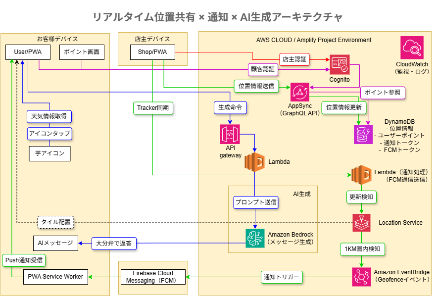
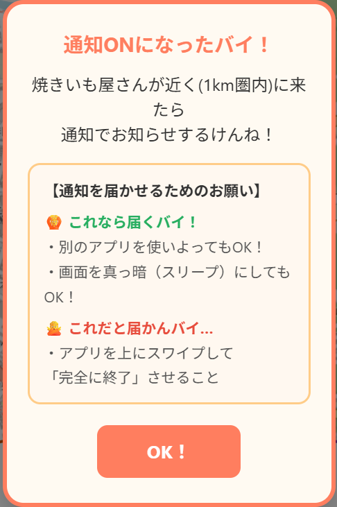

# donnatokiimo_map

## 移動式焼き芋屋の「今どこ？」をゼロにするリアルタイム位置共有アプリ

移動販売の焼き芋屋における
「今どこにいますか？」という問い合わせ対応を削減するために開発した、
**リアルタイム位置共有 × プッシュ通知 × ポイント機能**を備えたPWAアプリです。

---

## 🚀 デモ

※ここに動画を配置予定
（例: ``）

---

## 🧠 開発背景

副業で移動式焼き芋屋をしている義兄が、営業中に以下の問い合わせを頻繁に受けていました。

* 今どこにいますか？
* 今日はどの辺を回っていますか？
* まだ来ますか？

これらはすべて手動対応であり、
**運転中・接客中にも対応が必要になる非効率な業務**でした。

そこで、

* 店主は営業開始するだけ
* ユーザーは地図で現在地を確認
* 近づいたら通知
* QRでポイント付与

という仕組みを構築し、
**問い合わせ対応をシステムで自動化**しました。

---

## 🚀 運用状況

本アプリは **2026年4月より実運用を開始** しています。

実際の移動販売（焼き芋屋）にて利用されており、
現在地の問い合わせ削減および来店導線の改善に活用しています。

---

## 💰 コスト管理

AWSコスト管理として、以下の設定を行っています。

* AWS Budgets にて月額 **5ドルの上限アラート**を設定
* サーバーレス構成（Lambda / AppSync / DynamoDB）により低コスト運用
* イベント駆動設計により無駄な処理を削減

小規模事業者でも運用可能なコスト設計を意識しています。

---

## 🎯 解決した課題

| Before        | After     |
| ------------- | --------- |
| 電話・DM対応が必要    | 地図で確認可能   |
| 営業中に対応が発生     | 自動通知      |
| 来店タイミングが分からない | 接近通知で来店促進 |

---

## 🧩 主な機能

### 👨‍🍳 店主側

* 営業開始 / 停止
* リアルタイム位置配信（Geolocation API）
* QRコード発行（ポイント付与 / 消費）
* メニュー・スケジュール更新

### 👤 ユーザー側

* 地図で現在地確認（Leaflet）
* 現在地との距離表示
* 接近通知（プッシュ通知）
* QRコード読み取り（ポイント管理）
* 🍠アイコンタップで天気連動メッセージ表示（遊び機能）

---

## 🍠 遊び機能：天気 × AIメッセージ生成

ユーザー体験向上のため、遊び心として以下の機能を実装しています。

### 概要

地図上の「焼き芋アイコン」をタップすると、

* tsukumijima.netから現在の天気・気温を取得
* その情報をAmazon Bedrockに送信
* 焼き芋屋らしい販促メッセージを自動生成

### フロー

1. ユーザーが芋アイコンをタップ
2. tsukumijima.netから現在の天気情報を取得
3. Lambda経由でBedrockへリクエスト
4. AIが販促メッセージを生成
5. 画面に表示

### 例

* 「今日は寒いけん、あったかい焼き芋ば食べていかんね？」
* 「晴れとるけん、お散歩ついでに焼き芋どうや？」

### 意図

* 単なる機能ではなく「体験」を作る
* AWS（Bedrock）の実用的な使い方を取り入れる
* ユーザーに親しみやすさを持たせる

---

## 🔔 プッシュ通知の仕組み（Firebase）

本アプリでは、**Firebase Cloud Messaging（FCM）**を利用して通知を実装しています。

### フロー

1. ユーザーが通知許可
2. Firebaseでトークン取得
3. トークンをAppSyncに保存
4. ユーザー位置をもとにGeofence登録
5. 店主が移動
6. Location Serviceがジオフェンス侵入を検知
7. EventBridgeがイベント発火
8. Lambdaが通知処理
9. Firebase経由でユーザーへプッシュ通知

---

## 🏗 アーキテクチャ



### 構成のポイント

* フロントエンド：React + Vite + PWA
* 認証：Amazon Cognito
* API：AWS AppSync（GraphQL）
* DB：DynamoDB
* 位置管理：AWS Location Service
* イベント処理：EventBridge
* 通知：Lambda → Firebase Cloud Messaging
* AI連携：Amazon Bedrock

---

## ⚙️ 技術スタック

### フロントエンド

* React
* Vite
* React Leaflet
* AWS Amplify
* html5-qrcode
* qrcode.react

### バックエンド

* AWS AppSync (GraphQL)
* AWS Lambda
* Amazon DynamoDB

### インフラ / イベント

* AWS Location Service
* Amazon EventBridge

### 通知

* Firebase Cloud Messaging（FCM）

### AI

* Amazon Bedrock

### その他

* Weather API

---

## 💡 技術的な工夫

### ① イベント駆動設計

ポーリングではなく、Geofenceイベントをトリガーに通知処理を実行
→ **低コスト・高効率**

---

### ② リアルタイム位置更新

```js
navigator.geolocation.watchPosition(...)
```

位置変化に応じてAppSync + Location Service に即時反映

---

### ③ ジオフェンス活用

ユーザーごとに半径1kmのエリアを作成し、

* 入った → 通知
* 出た → 無視

を自動化

---

### ④ 不正防止QR

```
POTATO-<timestamp>-USE-<amount>
```

* 時間制限付(180秒)

* 再利用防止

---

### ⑤ UX × AIの融合

実用機能だけでなく、

* 天気
* 地域性(大分弁)
* 焼き芋

を掛け合わせたメッセージ生成により、
「また見たくなる体験」を意識

---

### ⑥ バッテリー・発熱を考慮した位置更新制御

移動販売の焼き芋屋は徒歩程度の速度で移動するため、  
高頻度での位置更新は不要と判断しました。

そのため、位置情報の更新間隔を**20秒に1回**に制御しています。

#### 意図
- スマートフォンのバッテリー消費を抑える
- GPS使用による発熱を防ぐ
- 通信回数を減らしコスト削減

#### 効果
- 長時間の営業でもスマホの負担を軽減
- 実運用に耐えられる安定した動作を実現

---

### ⑦ PWAの制約を考慮したUX設計

PWAはネイティブアプリと比較して、  
アプリを完全に終了した場合にプッシュ通知が届かないことがあります。

そのため、ユーザーが正しく利用できるように、  
通知設定時にガイドを表示する仕組みを実装しました。



#### 工夫
- 通知が届く条件 / 届かない条件を明示
- 専門用語を使わず、直感的に理解できる表現に調整
- 「スワイプで完全終了すると届かない」ことを明確に説明

#### 目的
- 通知の取りこぼし防止
- ユーザー体験の低下を防ぐ
- PWAの制約をUXで補完

非同期処理（Firebase Cloud Messaging）と組み合わせて通知機能を実装しつつ、  
PWA特有の制約をUXで補完する設計としています。

---

## 📊 監視（CloudWatch）

実運用に向けて、以下の監視を行っています。

### 監視対象

* Lambdaエラー（通知処理 / 位置更新 / AI連携）
* AppSync APIエラー
* Geofenceイベント処理（EventBridge）

### アラート設計

* Lambda Errors 発生時に通知
* 通知処理の失敗時に検知
* APIエラー増加時に通知

### 監視方針

ユーザー体験に直結する以下を重点監視：

* 通知が正常に届くこと
* 位置情報が更新されること
* APIが正常に応答すること

---

## 🧪 セットアップ

```bash
git clone https://github.com/supplay/donnatokiimo_map.git
cd donnatokiimo_map
npm install
```

```bash
amplify pull
npm run dev
```

---

## 📂 ディレクトリ構成

```
src/
├─ components/
├─ pages/
├─ graphql/
├─ amplify/
```

---

## 🔥 このプロジェクトでアピールしたいこと

* 実際の課題から設計している
* AWSマネージドサービスを組み合わせた構成
* イベント駆動アーキテクチャの実装
* フロント〜インフラまで一貫して開発
* 実運用（2026年4月〜）している
* UXを意識した遊び機能（AI活用）

---

## 🚧 今後の改善

* 通知精度のチューニング
* UI/UX改善
* マルチ店舗対応
* 分析機能の追加

---

## 👤 作者

supplay
https://github.com/supplay

---
