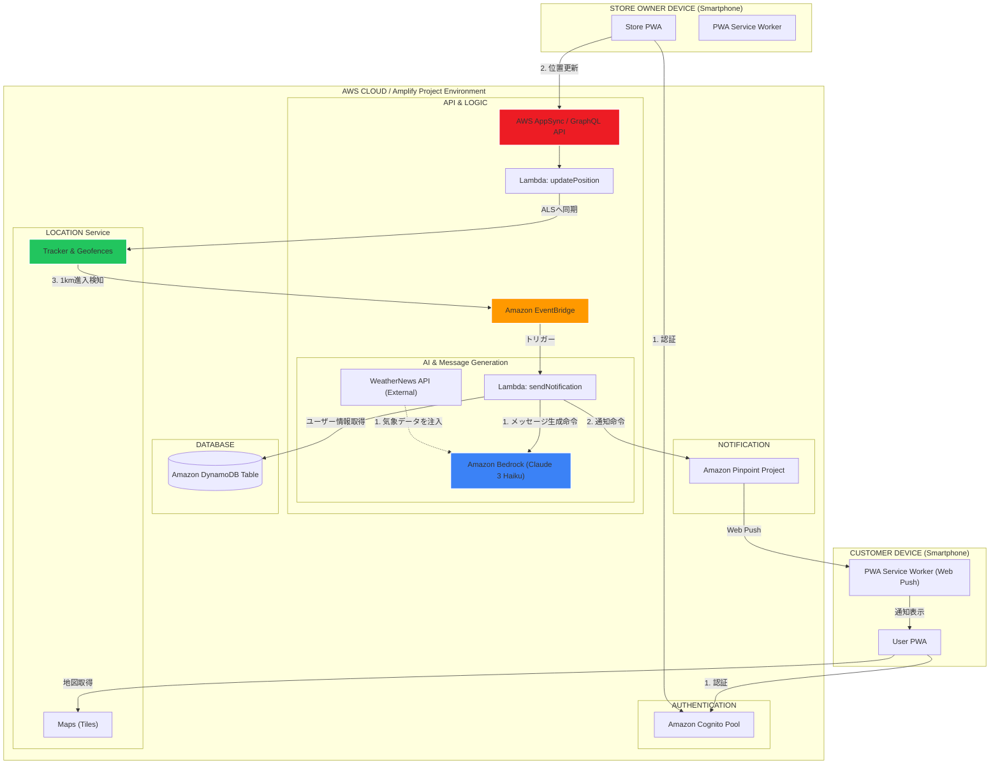

# 🍠 donnatokiimo_map  -Realtime SweetPotato Van Tracker- 🍠

移動販売の焼き芋屋さん（店主）と、焼き芋を買いたいお客さん（ユーザー）をつなぐ、リアルタイム位置情報＆ポイントシステムアプリです。PWA（Progressive Web App）として構築されており、スマートフォンのホーム画面に追加してアプリのように利用できます。

## 🌟 主な機能

### 👨‍🍳 店主向け機能 (Admin Page)
* **営業開始/停止**: 営業状態（マップへの表示有無）をワンクリックで切り替え。
* **リアルタイム位置配信**: `watchPosition`により、移動中も現在地を自動的にマップへ反映。
* **ポイント付与QR生成**: お客さんに読み取ってもらうための、セキュリティ（時間制限）付きポイント付与QRコードを表示。
* **特典交換QR生成**: お客さんのポイントを消費するための、ポイント数指定付きQRコードを表示。
* **メニュー・イベント出店予定編集**: アプリ上で販売メニューや今後のスケジュールを動的に更新。

### 🧑‍🤝‍🧑 お客さん向け機能 (Customer Page)
* **リアルタイム販売車マップ**: 営業中の焼き芋屋さんの現在地を Leaflet マップ上で確認。
* **現在地表示**: 自分の位置と販売車との距離感を把握。
* **ジオフェンス通知**: 販売車が自分の現在地から1km圏内に近づいた際、プッシュ通知でお知らせ。
* **天気連動メッセージ**: 店主アイコンをクリックすると、現在地の天気に合わせた店主からのメッセージを表示。
* **デジタルポイントカード**: ログインして、お店のQRコードをスキャンすることでポイントを収集・利用。


## 🛠 技術スタック

* **Frontend**: React, React Router
* **Build Tool**: Vite
* **UI/Styles**: Leaflet (Map), Tailwind CSS, Lucide React (Icons), AWS Amplify UI
* **Backend/Infrastructure (AWS Amplify)**:
    * **Authentication**: Cognito (店主・顧客の認証管理)
    * **API (GraphQL)**: AppSync (リアルタイムSubscription、データ操作)
    * **Database**: DynamoDB (店舗、設定、ポイント、サブスクリプション情報の格納)
    * **Functions**: Lambda (AWS Location Service との連携、外部API連携、AIロジックの実行)
    * **Location Service**: Maps, Geofences (地図タイル供給、ジオフェンス評価)
    * **Analytics/Push**: Pinpoint (プッシュ通知の配信)
    * **Amazon EventBridge**: ジオフェンスイベントのルーティング。Location Serviceが検知した「進入（ENTER）」イベントをトリガーに、通知用Lambdaを自動起動するイベントバスとして活用。
    * **Amazon Bedrock (Claude 3)**: Lambda経由で実行。気象データに基づいた「大分弁店主メッセージ」の動的生成。
* **External API**: WeatherNews API (weather.tsukumijima.net) - リアルタイム気象データの取得
* **PWA**: Service Worker, Web App Manifest

## 🌐インフラ構成図
本システムは、**イベント駆動型（Event-Driven）**のサーバーレスアーキテクチャを採用しています。




## システムアーキテクチャの解説
本アプリは、スケーラビリティとリアルタイム性を両立するため、AWS Amplifyをベースとしたイベント駆動型（Event-Driven）のサーバーレスアーキテクチャを採用しています。

### 💡 アーキテクチャの解説

1. **認証とリアルタイム同期**　
   ユーザーおよび店主の認証には **Amazon Cognito** を使用。店主のデバイスから送信される位置情報は、**AWS AppSync (GraphQL)** を経由して低遅延でバックエンドに送られ、**Amazon Location Service** のトラッカーに同期されます。

2. **イベント駆動型の接近検知**　
   店主が顧客の「半径1km圏内（ジオフェンス）」に進入すると、**Amazon EventBridge** がそのイベントを即座にキャッチし、通知用の **AWS Lambda** を起動します。これにより、クライアント側での常時ポーリング（監視）を排除し、デバイスのバッテリー消費とサーバーコストを最小限に抑えています。

3. **コンテキストを注入したAIメッセージ生成**　
   起動した Lambda 関数は、**WeatherNews API** からその対象エリアのリアルタイムな気象データ（天気・気温）を取得します。そのデータをプロンプトとして **Amazon Bedrock (Claude 3 Haiku)** に注入することで、「今の寒さ・暑さ」に寄り添った大分弁の接客メッセージを動的に生成します。


## 📦 インストールと起動

1.  **リポジトリをクローン**:
    ```bash
    git clone [https://github.com/yourusername/potatgo.git](https://github.com/yourusername/potatgo.git)
    cd potatgo
    ```

2.  **依存関係をインストール**:
    ```bash
    npm install
    ```

3.  **Amplify 環境を初期化 (初回のみ)**:
    ```bash
    amplify init
    # 既存の環境を引き継ぐ場合: amplify pull
    ```

4.  **ローカル開発サーバーを起動**:
    ```bash
    npm run dev
    ```

## 🛠 開発上の工夫・技術的ポイント
**1. Amazon Bedrock × 気象API による「動的接客」の実装**
単なる定型文の配信ではなく、**「その時、その場所、その天気にしか聞けない言葉」**をAIで生成する仕組みを構築しました。

・コンテキスト認識プロンプト: リアルタイムの天候・気温・時間帯をAIに注入。5℃以下の極寒時には「指先の気遣い」、28℃以上の猛暑時には「冷やし芋の提案」など、状況に即した動的なメッセージを生成。

・ペルソナ・エンジニアリング: 「大分で30年続く店主」という詳細な設定をMarkdown形式で構造化。大分弁（方言）の語彙や語尾を厳密に定義することで、AI特有の不自然さを排除した温かみのあるUXを実現しました。

・レスポンスの最適化: トークン効率を高める構造化プロンプトにより、生成速度（Latency）と精度のバランスを両立。

**2. ジオフェンスを活用したイベント駆動型プッシュ通知**
・AWS Location Service 連携: ジオフェンスの「Enter」イベントを Amazon EventBridge で検知し、Lambda経由でプッシュ通知を自動送出するサーバーレス構成を採用。

・VAPID認証によるセキュア通信: 公開鍵認証（VAPID）を採用し、ブラウザのプッシュサービス（FCM/APNs）を介した安全な配信経路を確保。

・PWA & Service Worker: メインスレッドから独立した Service Worker を実装し、バックグラウンドでの通知受信とネイティブアプリライクなインストール体験を提供。

**3. 実運用を見据えたUXとセキュリティの最適化**
リアルタイム同期: AppSync (GraphQL Subscription) を活用し、店主の移動に合わせてマップ上のアイコンがリロードなしでスムーズに動くリアルタイム性を追求。

・不正防止（時限式QRコード）: QRコードに3分間のみ有効なタイムスタンプを含め、ポイントの不正取得を防止するセキュリティロジックを実装。

・省電力・低負荷設計: 移動速度（徒歩〜徐行）に合わせ、現在地更新を20秒に1回に最適化。デバイスの発熱とバッテリー消費を抑える実運用に即した設計。

・堅牢なUI/UX: Reactでのステート管理によるレイアウトシフト防止や、Error Boundary の導入により、予期せぬエラー時もアプリ全体をクラッシュさせない親切な設計を徹底。

**4. 技術的制約を補完する「UXライティング」とデザイン**
・PWAにおけるOSのリソース制限（バックグラウンドでの位置情報計算の停止）という課題に対し、ユーザーの行動変容を促す施策を導入しました。

・期待値のコントロール: 画面を閉じると通知が届かない可能性があることを、おじさんのキャラクター性を活かしたメッセージ（「画面はそのままで待っちょってな！」）でポジティブに伝達。

・視覚的ヒューリスティクス: ✅（他のアプリ操作はOK）と⚠️（スリープ/タスク終了はNG）を対比させた直感的なガイドを実装。技術的な説明を避けつつ、ユーザーが「何をすべきか」を一目で理解できる設計を徹底しました。

・心理的オーナーシップの醸成: 単なる警告ではなく「おじさんの道案内をお願いする」という文脈にすることで、ユーザーの離脱を防ぎ、アプリとのエンゲージメントを高める工夫を施しました
